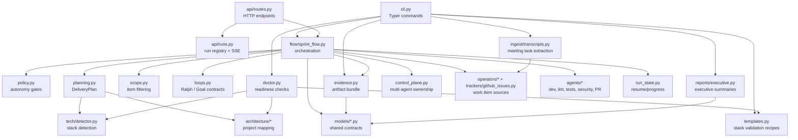

# C4 Level 3 - Python Package Components

This view maps the main `sendsprint/` package responsibilities to the delivery
flow used by CLI, API, dashboard, tests, and evidence generation.

## Component Rules

- Pure planning, policy, transcript, template, and report modules should stay independent of Typer and FastAPI.
- Side-effect boundaries should stay mockable through adapters around `gh`, HTTP, subprocesses, and filesystem writes.
- Dashboard/API changes should extend `RunReport` and API schemas instead of creating one-off UI-only fields.
- New tracker sources should feed the same sprint item and delivery plan models used by Jira, Azure DevOps, and GitHub Issues.
