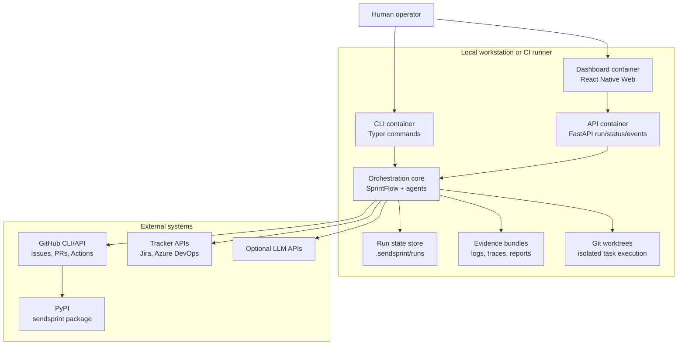

# C4 Level 2 - Containers

SendSprint is shipped as a Python package with a Typer CLI, optional FastAPI
backend, React Native Web dashboard, and local execution/evidence storage.

## Container Notes

- CLI is the primary operator entry point and owns command-line policy switches.
- API and dashboard expose the same run/report surface without creating a second domain model.
- Core orchestration owns planning, worktree isolation, validation, PR creation, and reporting.
- Local state and evidence are plain files so failed runs remain inspectable.
- Publishing is delegated to GitHub Actions and PyPI, not direct runtime code.
