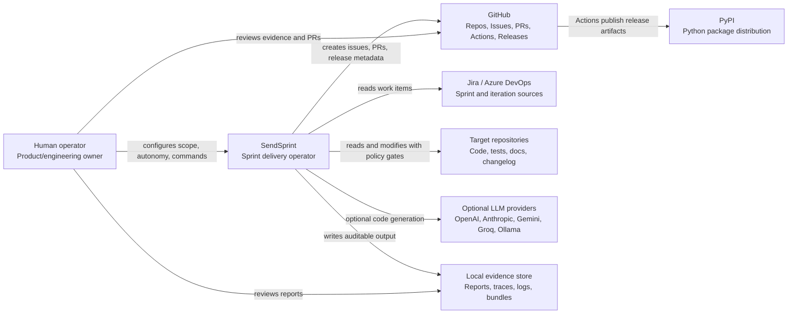

# C4 Level 1 - System Context

SendSprint coordinates sprint delivery work for a human operator. It reads
tracker items, plans repository work, executes validation, captures evidence,
and synchronizes GitHub pull requests, issues, releases, and package publishing.

## Responsibilities

- Keep dry-run and planning paths side-effect free.
- Gate write, commit, push, PR, release, and deploy actions by autonomy policy.
- Preserve a human-reviewable evidence trail for each run.
- Treat external systems as replaceable adapters instead of core domain logic.
